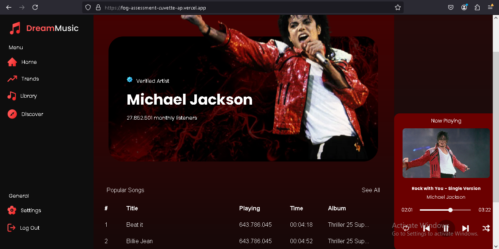

# 🎶 Music Player UI Assessment - FOG

  

A feature-rich, responsive Music Player UI built with **React.js** and **Node.js**. This project includes essential functionalities for a dynamic music player, including drag-and-drop song ordering, interactive playback controls, and responsive design.

## 🌟 Features

- **Drag-and-Drop Reordering**: Easily rearrange songs in the playlist by dragging and dropping them.
- **Interactive Playback**: Start, pause, and switch between songs with intuitive playback controls.
- **Now Playing Highlight**: Highlights the currently playing song in the playlist for easy tracking.
- **Responsive Design**: Optimized for various screen sizes and devices.


## 🖼️ Project Preview

  
*A sleek and modern design in line with the provided Figma assets.*


## 🚀 Getting Started

### 1. Clone the Repository
```bash
git clone https://github.com/amaan92001/FOG_Assessment_Cuvette_AP.git
cd FOG_Assessment_Cuvette_AP
```

### 2. Install Dependencies
Make sure you have [Node.js](https://nodejs.org/) installed. Then run:
```bash
npm install
```

### 3. Start the Server
```bash
npm start
```

### 4. Run the App
Access the music player at `http://localhost:5000`.


## 🎛️ Usage

### Playlist
- Drag and drop songs to change their order.
- Click a song to start playback, which automatically highlights the current song.

### Player Controls
- **Play/Pause**: Controls playback.
- **Previous/Next**: Navigate between songs in the playlist.
  
## 🌐 Hosting and Deployment

Consider deploying to **Netlify**, **Vercel**, **Render**, or **GitHub Pages** for a live demo.

1. **Netlify**: Connect your repository and deploy.
2. **Vercel**: Ideal for serverless React apps with fast deployment.
3. **GitHub Pages**: Easy setup for static sites.


## 🤝 Contributing

Contributions are welcome! Feel free to open issues and pull requests to improve the project.
